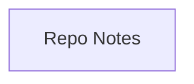

## Stack

Not a code project yet. Repo contains only `README.md` and `.gitignore` — no manifest (no package.json/go.mod/etc.), no source files, no entry points. README (`README.md`) describes an intended future MEAN stack (MongoDB, Express.js, Angular, Node.js) but none of it has been scaffolded.

## Directory map

| path | what lives there |
|------|-------------------|
| `/` | `README.md`, `.gitignore` — no other files or subdirectories |

## Diagram

## Component index

- [[Repo_Notes]] — the only content in the repo (README.md)

## Entry points

- Dev: none exist. TODO: verify once a `server/` and `client/` are scaffolded (README's suggested layout).
- Prod: none exist.

## Conventions

- None observed — no source files to derive conventions from.

## Where things go

- To start actual development, follow README's "Typical MEAN project setup" section (`README.md` lines 51-62): create `server/` (npm init, express/mongoose/cors) and `client/` (Angular CLI `ng new`).
- Once a manifest exists (`server/package.json`, `client/package.json` or root `package.json`), re-run documentation to populate stack, entry points, and conventions with real data.
